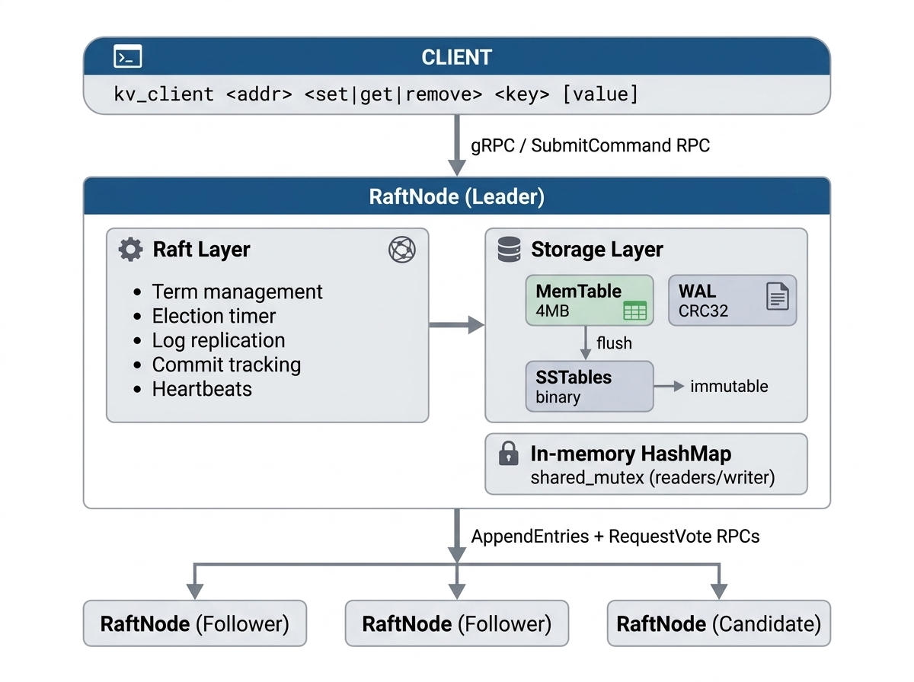
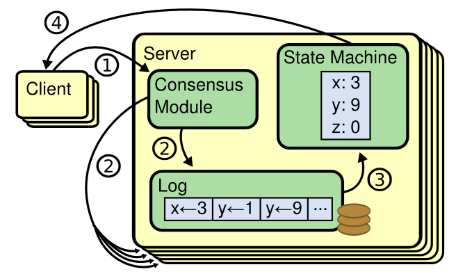
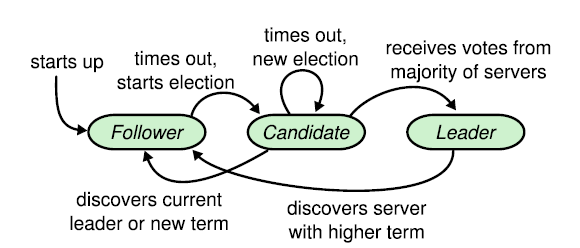
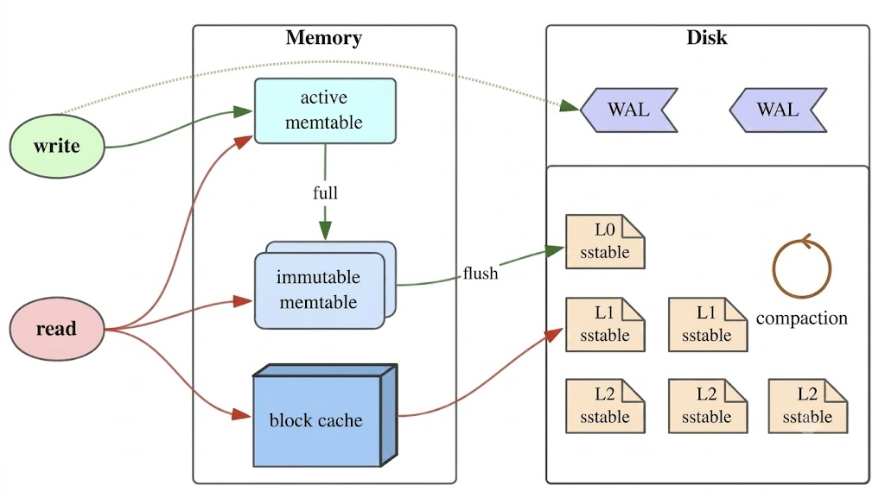

<h1 align="center">Octane</h1>

A fault-tolerant distributed key-value store built from scratch in C++17, implementing the Raft consensus algorithm over gRPC/Protobuf for inter-node communication, with an LSM-Tree storage engine and CRC32-validated Write-Ahead Log for crash resiliency.

---

## Why Octane?

Most distributed storage systems treat the consensus layer, storage engine, and network transport as separate components. Octane aims to implement all three from scratch:

- **Consensus** - Raft leader election and log replication with randomized 150–300ms timeouts to prevent split votes
- **Storage** - LSM-Tree engine with 4MB MemTable flush threshold and immutable binary SSTables
- **Durability** - CRC32-validated WAL that survives crashes and replays state deterministically
- **Concurrency** - Shared mutex pattern that decouples high-throughput concurrent reads from serialized disk flushes

---

## Architecture



Each node maintains a full replica of the log and state machine. Writes go through the leader, which replicates to a majority before committing. 

---

## Components

### RaftNode - Consensus Layer

`src/core/raft_node.cpp` · `include/kvstore/raft_node.hpp`




The core Raft state machine. Each node is always in one of three roles:

| Role | Responsibilities |
|------|-----------------|
| **Follower** | Responds to `AppendEntries` heartbeats, resets election timer on each valid heartbeat, grants votes if candidate's log is at least as up-to-date |
| **Candidate** | Triggered when election timer fires, increments term, votes for self, broadcasts `RequestVote` to peers, becomes Leader on majority grant |
| **Leader** | Handles all client `SubmitCommand` RPCs, replicates log entries via `AppendEntries`,  sends periodic heartbeats to suppress follower elections |

**Election timeout** is randomized between 150ms and 300ms per node. This asymmetry is the mechanism that prevents split votes - the node with the shortest timeout in any given round will almost always win the first election before others start campaigning.

**Log replication** follows the standard Raft protocol: leader appends to its own log, issues parallel `AppendEntries` RPCs to all followers, and advances `commitIndex` once a majority responds with success. Followers apply committed entries to their local state machines in order.

**Term-based validity** ensures stale leaders self-demote: any RPC response with a higher term causes the receiving node to immediately revert to Follower.

---

### KVStore - In-Memory State Machine

`src/core/store.cpp` · `include/kvstore/store.hpp`

```
get(key)     shared_lock     (concurrent reads, no blocking between readers)
set(key, v)  unique_lock     (exclusive write, blocks new readers)
remove(key)  unique_lock     (exclusive write, blocks new readers)
```

The shared mutex pattern is a deliberate tradeoff: reads in a distributed KV store are typically much more frequent than writes, so allowing concurrent readers significantly increases read throughput without adding complexity of a lock-free structure.

---

### LSM-Tree Storage Engine

`src/core/wal.cpp` · `include/kvstore/wal.hpp`

Octane uses a Log-Structured Merge-Tree architecture for its on-disk storage:



**MemTable** holds recent writes in memory. It accepts mutations until it reaches the 4MB threshold, at which point it is frozen and flushed to a new SSTable. A fresh MemTable is created for subsequent writes. Background flushes are decoupled from client reads using the shared mutex - reads continue to be served from the in-memory HashMap while the flush happens concurrently.

**SSTables** are immutable binary files. Once written, they are never modified, compaction or deletion creates new files. Immutability simplifies crash recovery: a partially written SSTable from a crash is simply discarded, the WAL has the source of truth.

**WAL** is the durability anchor. Each entry is validated with a CRC32 checksum on read. Corrupted entries (from a partial write at crash time) are detected and the recovery stops at the last valid entry. On startup, `recover()` replays valid WAL entries in order to reconstruct the MemTable.

```
WAL entry format:
  [ CRC32 (4 bytes) | op_type (1 byte) | key_len (4 bytes) | key | value_len (4 bytes) | value ]
```

---

### gRPC Protocol

`proto/raft.proto`

Three RPCs cover all inter-node and client-to-cluster communication:

| RPC | Caller -> Callee | Purpose |
|-----|-----------------|---------|
| `RequestVote(term, candidateId, lastLogIndex, lastLogTerm)` | Candidate -> all Followers | Leader election, follower grants vote if it hasn't voted this term and candidate's log is at least as complete |
| `AppendEntries(term, leaderId, prevLogIndex, prevLogTerm, entries[], leaderCommit)` | Leader -> all Followers | Log replication, also serves as heartbeat when `entries` is empty |
| `SubmitCommand(op, key, value)` | Client -> Node | Submit a KV operation, |


---

## Design Decisions

- gRPC provides strong typing via Protobuf, automatic serialization/deserialization, built-in connection management and retries, and bidirectional streaming support for future optimizations (e.g. streaming `AppendEntries` for large log batches). Raw TCP with a custom protocol would require implementing all of this manually.

- LSM-Trees optimize for write throughput by converting random writes into sequential appends (WAL -> MemTable -> SSTable). A B-Tree would require in-place page updates, which are more expensive on spinning disks and require more complex crash recovery.

- The WAL is fsynced before the MemTable is updated. This ensures that on crash recovery, the WAL is always at least as current as the in-memory state. Updating the MemTable first, would create a window where a committed mutation exists in memory but not on disk, meaning it would be lost on crash.

- Deterministic timeouts cause all followers to become candidates simultaneously when a leader dies, leading to a split vote where no candidate can win a majority. The 150–300ms random range means nodes stagger their elections naturally.

---

## Project Structure

```
octane/
├── include/
│   └── kvstore/
│       ├── raft_node.hpp       # Raft state machine, role definitions, RPC handlers
│       ├── store.hpp           # KVStore interface, shared_mutex declarations
│       └── wal.hpp             # WAL interface, entry format, CRC32 validation
├── proto/
│   └── raft.proto              # gRPC service: RequestVote, AppendEntries, SubmitCommand
├── src/
│   └── core/
│       ├── raft_node.cpp       # Raft implementation: election, replication, heartbeats
│       ├── store.cpp           # In-memory HashMap with shared_mutex
│       └── wal.cpp             # WAL append, fsync, CRC32, recovery
├── CMakeLists.txt              # Build config: gRPC/Protobuf, C++17, generates kv_server + kv_client
└── README.md
```

---

## Building

**Dependencies**

- C++17 compiler (GCC 9+ or Clang 10+)
- CMake 3.14+
- gRPC 1.40+ with C++ plugin
- Protobuf 3.9+

**Build**

```bash
mkdir -p build
cmake --build build
```

This produces two binaries in `build/`:
- `kv_server` - Raft node server
- `kv_client` - CLI client

---

## Running a 3-Node Cluster

Each `kv_server` invocation takes a node ID, its own port, and the ports of all peer nodes.

```bash
# Terminal 1 - Node 0 on port 50051
./kv_server 0 50051 50052 50053

# Terminal 2 - Node 1 on port 50052
./kv_server 1 50052 50051 50053

# Terminal 3 - Node 2 on port 50053
./kv_server 2 50053 50051 50052
```

Wait for leader election (~300ms), then interact via the client:

```bash
./kv_client localhost:50051 set foo bar
./kv_client localhost:50051 get foo       
./kv_client localhost:50051 remove foo
./kv_client localhost:50051 get foo        
```

**Fault tolerance test** - kill one node and continue writing, the remaining two form a majority and keep making progress. Restart the killed node and it will catch up via log replication.

---

## Fault Tolerance Guarantees

| Scenario | Behaviour |
|----------|-----------|
| Leader crashes | Followers detect missing heartbeat after election timeout, new leader elected within ~300ms |
| Follower crashes | Cluster continues (majority still available in a 3-node setup), crashed follower receives missed log entries on rejoin |
| Crash mid-write (before WAL fsync) | Write is lost, consistent with Raft, entry was never committed to a majority |
| Crash mid-flush (SSTable partial write) | Partial SSTable discarded on recovery, WAL replays from last valid CRC32 entry |

---

## Benchmarks

Octane is designed for high-throughput and low-latency, utilizing group commits and network batching to decouple slow disk I/O and network broadcasts from the client's critical path.

### End to End load testing

The entire cluster can be tested using [ghz](https://ghz.sh/), a gRPC benchmarking tool
#### Setup:
1. Install `ghz`
2. Start a cluster
3. Target the leader node (here, sending 10,000 commands via 100 concurrent clients)

```
ghz --insecure \
    --proto ./proto/raft.proto \
    --call raftpb.RaftNode.SubmitCommand \
    -d '{"command": "SET stress_key stress_value"}' \
    -c 100 -n 10000 \
    0.0.0.0:50051
```

#### Benchmarks:
- Throughput: >25,000 req/sec
- Average Latency: ~3.2ms
- P99 Tail Latency: ~7.3ms
- Success rate: 100% (no dropped connections)

Performance may vary based on disk limitations and network latency between nodes

```
Summary:
  Count:        10000
  Total:        399.76 ms
  Slowest:      16.15 ms
  Fastest:      0.33 ms
  Average:      3.22 ms
  Requests/sec: 25014.84

Response time histogram:
  0.327  [1]    |
  1.909  [982]  |∎∎∎∎∎∎∎
  3.491  [5667] |∎∎∎∎∎∎∎∎∎∎∎∎∎∎∎∎∎∎∎∎∎∎∎∎∎∎∎∎∎∎∎∎∎∎∎∎∎∎∎∎
  5.074  [2698] |∎∎∎∎∎∎∎∎∎∎∎∎∎∎∎∎∎∎∎
  6.656  [486]  |∎∎∎
  8.238  [109]  |∎
  9.820  [46]   |
  11.402 [7]    |
  12.985 [2]    |
  14.567 [1]    |
  16.149 [1]    |

Latency distribution:
  10 % in 1.92 ms
  25 % in 2.48 ms
  50 % in 3.05 ms
  75 % in 3.78 ms
  90 % in 4.62 ms
  95 % in 5.42 ms
  99 % in 7.34 ms
```

---

## Tech Stack

| Component | Technology |
|-----------|-----------|
| Language | C++17 |
| Consensus | Raft  |
| Transport | gRPC 1.40+ |
| Serialization | Protocol Buffers (Protobuf 3) |
| Build system | CMake 3.14+ |
| Storage | Custom LSM-Tree (WAL + MemTable + SSTables) |
| Checksum | CRC32 (WAL entry validation) |

